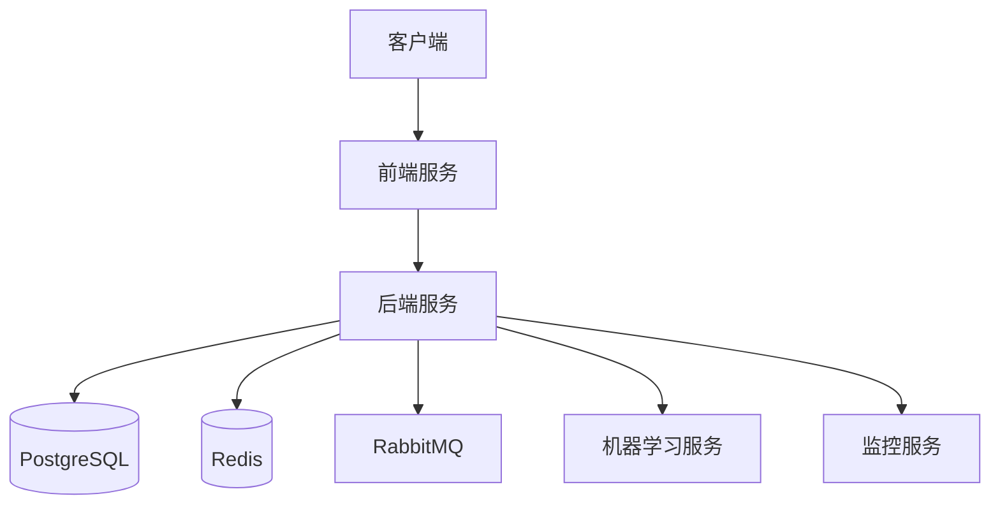

# 架构设计

ARIES 采用现代化的微服务架构，本文档详细说明系统的整体架构设计。

## 系统架构图

## 核心组件

### 1. 前端服务 (Frontend)

- **技术栈**：Vue.js + TypeScript
- **主要功能**：
  - 用户界面展示
  - 数据可视化
  - 实时数据更新
  - 用户交互处理
- **关键特性**：
  - 响应式设计
  - 组件化开发
  - 状态管理
  - WebSocket 实时通信

### 2. 后端服务 (Backend)

- **技术栈**：Python + FastAPI
- **主要功能**：
  - API 接口提供
  - 业务逻辑处理
  - 数据分析和处理
  - 安全认证
- **关键特性**：
  - RESTful API
  - WebSocket 支持
  - 异步处理
  - 中间件支持

### 3. 数据存储 (PostgreSQL)

- **主要功能**：
  - 用户数据存储
  - 网络流量数据
  - 分析结果存储
  - 系统配置存储
- **关键特性**：
  - 数据持久化
  - 事务支持
  - 数据备份
  - 性能优化

### 4. 缓存服务 (Redis)

- **主要功能**：
  - 会话管理
  - 数据缓存
  - 实时数据存储
  - 消息队列
- **关键特性**：
  - 高性能
  - 数据持久化
  - 发布订阅
  - 分布式锁

### 5. 消息队列 (RabbitMQ)

- **主要功能**：
  - 异步任务处理
  - 服务间通信
  - 任务调度
  - 负载均衡
- **关键特性**：
  - 消息持久化
  - 消息确认
  - 死信队列
  - 延迟队列

### 6. 机器学习服务

- **主要功能**：
  - 网络行为分析
  - 异常检测
  - 预测分析
  - 模型训练
- **关键特性**：
  - 实时分析
  - 模型更新
  - 特征提取
  - 结果评估

### 7. 监控服务

- **主要功能**：
  - 系统监控
  - 性能监控
  - 告警管理
  - 日志收集
- **关键特性**：
  - 实时监控
  - 告警通知
  - 性能分析
  - 日志分析

## 数据流

1. **数据采集**：
   - 网络流量数据采集
   - 系统日志收集
   - 用户行为记录

2. **数据处理**：
   - 数据清洗和预处理
   - 特征提取
   - 数据分析

3. **数据存储**：
   - 原始数据存储
   - 分析结果存储
   - 缓存数据管理

4. **数据展示**：
   - 实时数据展示
   - 历史数据查询
   - 分析报告生成

## 安全设计

1. **认证授权**：
   - JWT 认证
   - OAuth2 支持
   - 角色权限控制

2. **数据安全**：
   - 数据加密
   - 传输加密
   - 敏感信息保护

3. **访问控制**：
   - API 访问控制
   - 资源访问控制
   - 操作审计

## 扩展性设计

1. **水平扩展**：
   - 服务无状态
   - 负载均衡
   - 分布式部署

2. **垂直扩展**：
   - 模块化设计
   - 插件系统
   - 自定义扩展

## 部署架构

1. **开发环境**：
   - 本地开发环境
   - 开发服务器
   - 测试环境

2. **生产环境**：
   - 容器化部署
   - 集群部署
   - 高可用设计

## 性能优化

1. **前端优化**：
   - 代码分割
   - 懒加载
   - 缓存策略

2. **后端优化**：
   - 数据库优化
   - 缓存优化
   - 异步处理

3. **网络优化**：
   - CDN 加速
   - 负载均衡
   - 连接池管理 